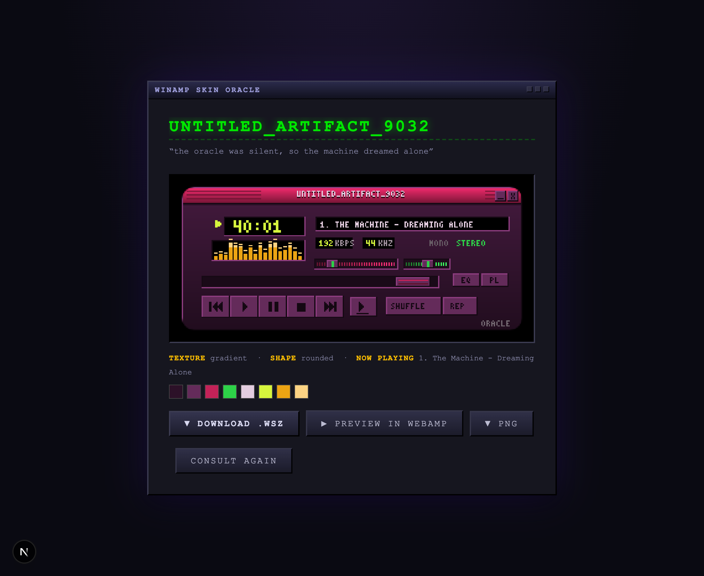
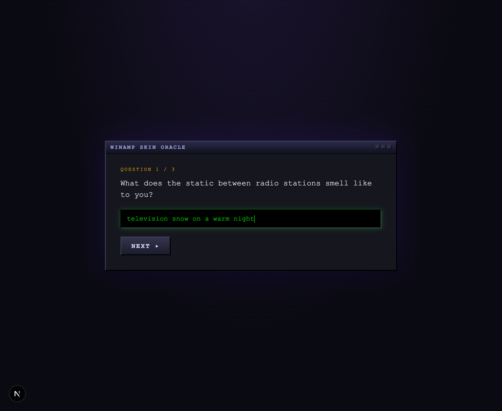
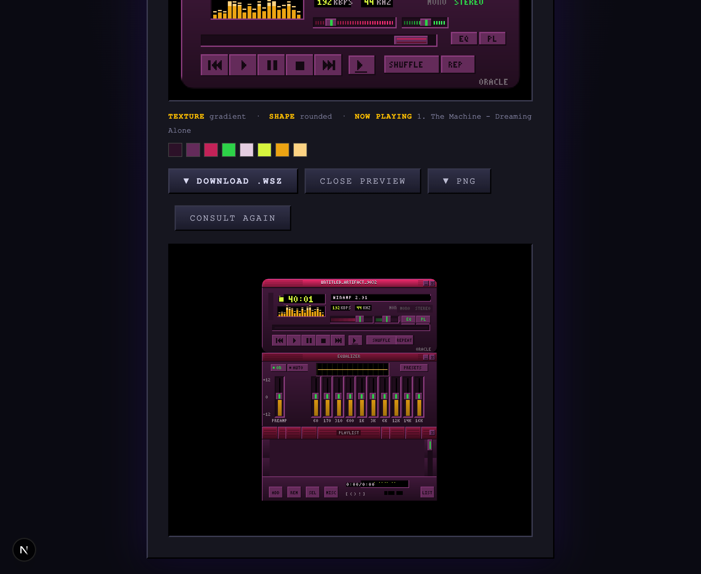

# Winamp Skin Oracle

Answer three nonsensical questions. Receive a fully functional classic Winamp skin. **It really whips.**



The oracle asks you things like *"What does the static between radio stations smell like to you?"* — your answers are treated as a dead-serious creative brief and turned into a complete Winamp 2.x skin: palette, chassis texture, window silhouette, skin name, and a fake "now playing" track. Download it as a real `.wsz` that loads in Winamp and [Webamp](https://webamp.org), or preview it instantly in an embedded Webamp player.

## Features

- **Model-generated questions** — Claude (Sonnet 4.6) writes three fresh surreal questions per session, each secretly probing a design axis (color/light, texture/material, mood/energy)
- **Model-generated designs** — your answers become an 8-color palette, a texture (`scanlines · noise · checker · diagonal · gradient`), a window shape, a skin name in authentic late-90s skin-site style, and a one-line `readme.txt`-grade vibe
- **Real `.wsz` export** — a genuine Winamp 2.x skin archive with all three windows fully skinned:
  - `MAIN.BMP`, `TITLEBAR.BMP`, `CBUTTONS.BMP`, `NUMBERS.BMP`, `TEXT.BMP`, `VOLUME.BMP`, `BALANCE.BMP`, `POSBAR.BMP`, `MONOSTER.BMP`, `PLAYPAUS.BMP`, `SHUFREP.BMP`
  - `EQMAIN.BMP` — full equalizer art: 28 slider-position frames, ON/AUTO/PRESETS states, spectrum graph color ramp
  - `PLEDIT.BMP` — full playlist art: tileable frame segments, button clusters, scrollbar handles, windowshade strips, and all five popup menus
  - `VISCOLOR.TXT`, `PLEDIT.TXT`, `REGION.TXT`, `README.TXT`
- **Window shapes** — `classic`, `rounded`, `chamfered`, `jagged`, or `melted` silhouettes, implemented the authentic way via `REGION.TXT` polygons
- **Live Webamp preview** — a real Winamp engine running your skin in the page, draggable windows and all
- **Rename your skin** — edit the name and watch the title bar, downloads, and live preview update
- **PNG export** — a 4× pixel-perfect render of the main window (with transparency outside shaped silhouettes)
- **Zero-dependency binary formats** — the BMP encoder and the ZIP (`.wsz`) writer are hand-rolled in ~120 lines; the only runtime deps are Next.js, React, the Anthropic SDK, and Webamp

## Screenshots

| The ritual | The verdict |
| --- | --- |
|  |  |

## How it works

```
3 surreal questions          your answers              canvas + bytes
┌──────────────────┐    ┌─────────────────────┐    ┌──────────────────────┐
│ /api/questions    │ →  │ /api/skin            │ →  │ lib/winamp.ts (draw) │
│ Claude + JSON     │    │ Claude turns answers │    │ lib/wsz.ts (BMP+ZIP) │
│ schema output     │    │ into a design spec   │    │ → .wsz / .png        │
└──────────────────┘    └─────────────────────┘    └──────────────────────┘
```

1. **Questions** — `app/api/questions/route.ts` asks Claude for three weird questions using structured outputs (a JSON schema constrains the response, so parsing never fails).
2. **Design spec** — `app/api/skin/route.ts` sends the Q&A transcript to Claude, which returns a `SkinSpec`: skin name, vibe line, 8 hex colors, texture, shape, and track title.
3. **Rendering** — `lib/winamp.ts` draws the classic 275×116 main window pixel-by-pixel on a canvas, using a hand-rolled 3×5 bitmap font. Your answers seed the RNG, so the same answers always produce the same visualizer bars and timestamps.
4. **The .wsz** — `lib/wsz.ts` draws every sprite sheet (main, EQ, playlist — sprite coordinates verified against Webamp's source), encodes them as 24-bit BMPs, and packs everything into a store-only ZIP renamed `.wsz`.
5. **Fallbacks everywhere** — no API key? The oracle falls back to built-in questions and derives a deterministic palette from a hash of your answers. The app never breaks.

## Getting started

```bash
npm install
echo 'ANTHROPIC_API_KEY=sk-ant-...' > .env.local   # optional but much weirder with it
npm run dev
```

Open http://localhost:3000 and begin the ritual.

Without an API key the app runs in fallback mode (canned questions, hash-derived palettes). With one, Claude generates everything fresh per session.

## Using your skin

- **Webamp**: drag the `.wsz` onto [webamp.org](https://webamp.org)
- **Winamp**: drop it in `C:\Program Files\Winamp\Skins\` and pick it under Options → Skins
- The in-app **Preview in Webamp** button does this for you without leaving the page

## Deploy

Deploys anywhere Next.js runs. On [Vercel](https://vercel.com): import the repo, set `ANTHROPIC_API_KEY` in the project's environment variables, and ship.

---

*Generated skins are deterministic per answer set. The llama's whipping status is not configurable.*
